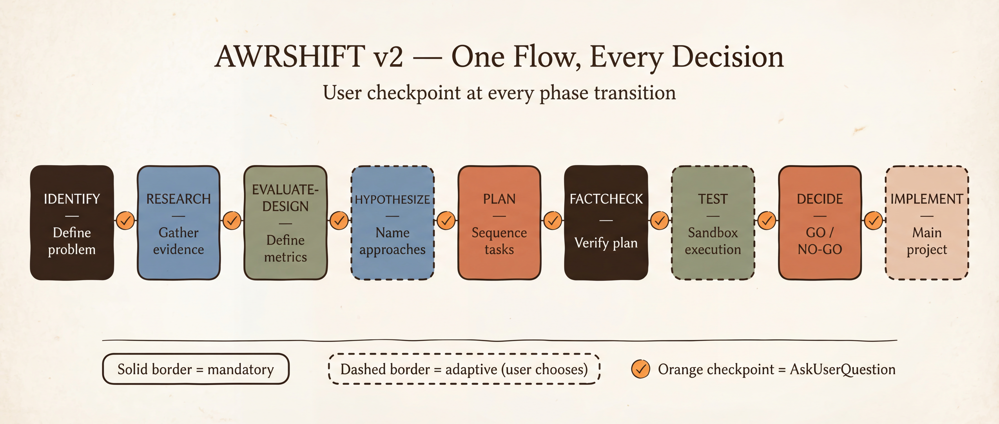

<div align="center">


# AWRSHIFT v2

**Adaptive decision framework for AI agents. User checkpoints at every phase.**

*Works with any AI coding assistant that supports [Agent Skills](https://agentskills.io)*

</div>

---

## Why

AI agents jump to implementation. Most failures come from building the wrong thing. AWRSHIFT makes your agent research, define metrics, factcheck, and test in a sandbox — all before touching your main project. One dynamic flow adapts to any task complexity.

<div align="center">

</div>

---

## What's New in v2

| v1.0 | v2.0 |
|------|------|
| 3 modes (Quick/Standard/Scientific) | **1 dynamic flow** — scope adapts per phase |
| Text-based questions | **AskUserQuestion** — structured A/B/C/D choices at every checkpoint |
| No metrics phase | **EVALUATE-DESIGN** — mandatory success criteria before planning |
| Factcheck only in Scientific | **FACTCHECK** — mandatory for all scopes |
| No sandbox rules | **10 safety rules** — experiment sandbox is isolated from main project |
| No implementation gate | **Double gate** — DECIDE(GO) + file-by-file preview before touching main project |

## How It Works

One flow. User controls depth.

```
IDENTIFY → RESEARCH → EVALUATE-DESIGN → HYPOTHESIZE → PLAN → FACTCHECK → TEST → DECIDE → [IMPLEMENT]
```

At **every phase transition**, the agent:
1. Tells you what was done
2. Explains what happens next
3. Asks you to choose (A/B/C/D or your own direction)

You're always in control. The agent never proceeds silently.

## Quick Install

**Claude Code:**
```bash
mkdir -p .claude/skills/awrshift
curl -sL https://raw.githubusercontent.com/awrshift/skill-awrshift/main/SKILL.md \
  -o .claude/skills/awrshift/SKILL.md
```

## Usage

| You say | AWRSHIFT does |
|---------|--------------|
| "Let's think this through" | Starts IDENTIFY — asks structured questions one by one |
| "Research first" | RESEARCH phase — generates questions, asks you to validate, dispatches agents |
| "Compare approaches" | HYPOTHESIZE — names options, presents comparison table |
| "What metrics should we use?" | EVALUATE-DESIGN — proposes measurable success criteria |
| "Factcheck this plan" | FACTCHECK — verifies plan against original context + optional Gemini |
| "Experiment on [topic]" | Creates experiment folder, starts full flow |

## Experiment Structure

Every experiment creates persistent documentation in your project:

```
experiments/{NNN}-{short-name}/
├── PLAN.md              ← Status, phases, metrics, decisions
├── research/
│   └── 01-{topic}.md    ← Agent findings
├── factcheck.md         ← Verification results
└── [artifacts]           ← Code, configs, outputs
```

## Sandbox Safety

During experiments, the agent NEVER modifies your main project files:
- All work happens in `experiments/` folder
- Main project files are read-only (for context)
- Only after DECIDE(GO) + your explicit approval → changes proposed to main project
- You see exact file list before any modification

## Integration

| Skill | When | Purpose |
|-------|------|---------|
| **brainstorm** | HYPOTHESIZE phase | Multi-model ideation (Claude x Gemini) |
| **gemini** | FACTCHECK phase | Cross-model verification |

Both optional. Framework works standalone.

## Key Principles

1. **User-in-the-loop** — AskUserQuestion at every phase transition
2. **Metrics before planning** — define success criteria before building
3. **Factcheck before testing** — verify plan against evidence
4. **Sandbox first** — test in experiments/, implement later
5. **Evidence-based decisions** — GO/NO-GO with measured metrics

## Works With

| Platform | Install |
|----------|---------|
| Claude Code | Copy `SKILL.md` to `.claude/skills/awrshift/` |
| Codex CLI | Copy `SKILL.md` to `.openai/skills/awrshift/` |
| Gemini CLI | Copy `SKILL.md` to `.gemini/skills/awrshift/` |
| Cursor | Copy `SKILL.md` to `.cursor/skills/awrshift/` |

## Part of the AWRSHIFT Ecosystem

- [**claude-starter-kit**](https://github.com/awrshift/claude-starter-kit) — ready-to-use project structure with memory, hooks, skills
- [**skill-brainstorm**](https://github.com/awrshift/skill-brainstorm) — 3-round Claude x Gemini adversarial dialogue
- [**skill-gemini**](https://github.com/awrshift/skill-gemini) — Gemini toolkit for second opinions, images, diagrams

## License

MIT — see [LICENSE](LICENSE) for details.

---

<div align="center">
<em>Think before you build. Research before you code. Decide with evidence.</em>
</div>
